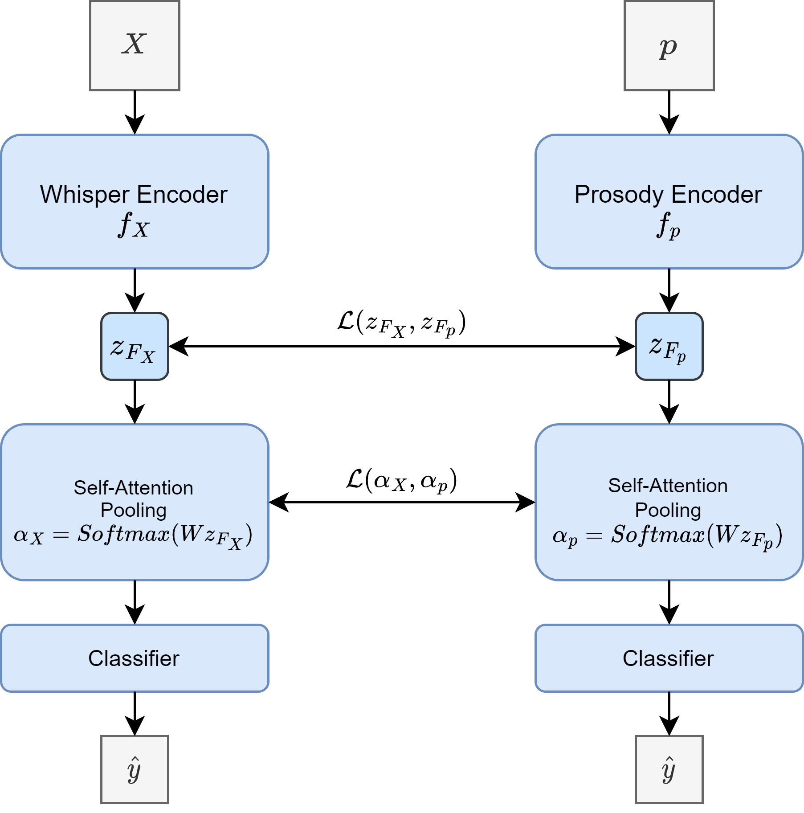
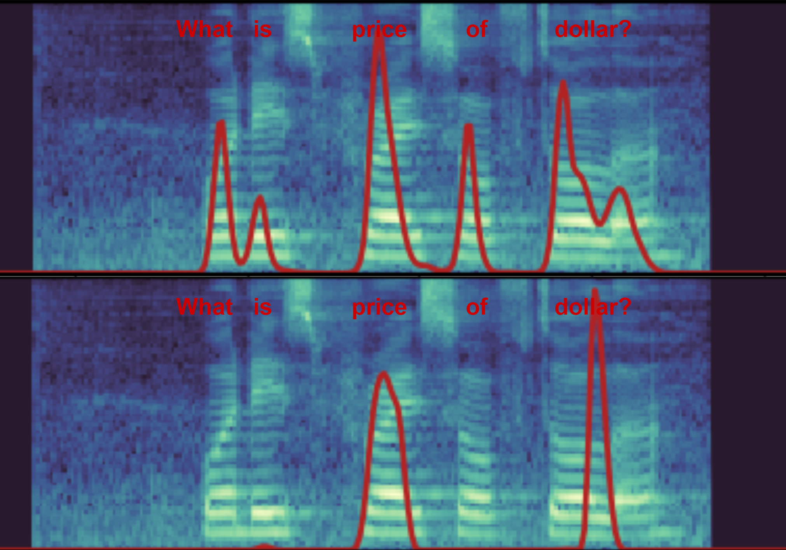
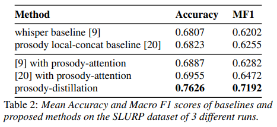
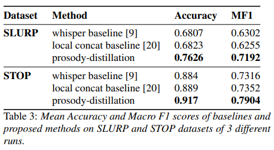
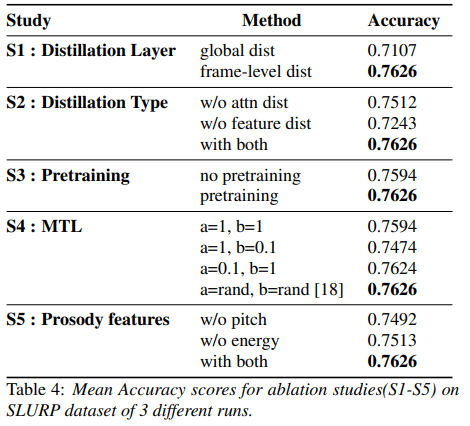

# s2i-prosody
This repository is the official implementation of the paper [Improving End-to-End SLU performance with Prosodic Attention and Distillation]() (accepted at Interspeech 2023). 
<figure align="center"><figcaption>The proposed prosody-distillation method</figcaption></figure>

**Abstract:**
Most End-to-End SLU methods depend on the pretrained ASR or language model features for intent prediction. However, other essential information in speech, such as prosody, is often ignored. Recent research has shown improved results in classifying dialogue acts by incorporating prosodic information. The margins of improvement in these methods are minimal as the neural models ignore prosodic features. In this work, we propose prosody-attention, which uses the prosodic features differently to generate attention maps across time frames of the utterance. Then we propose prosody-distillation to explicitly learn the prosodic information in the acoustic encoder rather than concatenating the implicit prosodic features. Both the proposed methods improve the baseline results, and the prosody-distillation method gives an intent classification accuracy improvement of 8\% and 2\% on SLURP and STOP datasets over the prosody baseline.


# Installation 

```bash
git clone https://github.com/skit-ai/s2i-prosody
cd s2i-prosody

conda create -n env_name --file requirements.txt
conda activate env_name
```

## Training and Evaluation
Change the dataset, training method and training hyperparamerters in train.py.

Datasets:
- SLURP
- STOP

Training Methods:
- Baseline Whisper
- Baselines Prosody Concat
- Prosody-Attention
- prosody-Distillation

```bash
python train.py
```

## Visualization of Attention Map
<figure align="center"><figcaption>Attention maps of prosody-attention(upper) and prosody-distillation(lower)</figcaption></figure>

# Results
<figure align="center"></figure>

<figure align="center"></figure>

<figure align="center"></figure>


# Citation


# References
